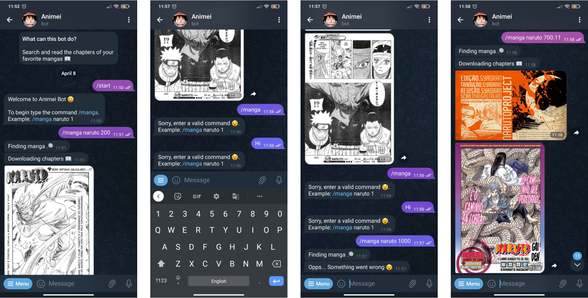

# Animei Bot
### Golang Telegram Bot to Search and Read Mangas

## Comands
- Clone the repository.
``` bash
git clone git@github.com:chrissgon/animeibot.git
```
- Run application.
``` bash
TOKEN_BOT=<YOUR_TOKEN> BASE_API=<API_HOST> go run main.go
```
- Build application.
``` bash
TOKEN_BOT=<YOUR_TOKEN> BASE_API=<API_HOST> go build main.go
```

## Anotations
<!-- Application hosted in <a href="http://localhost:3000/">http://localhost:3000/</a>. -->

## References
- [Go Telegram Bot](https://github.com/go-telegram-bot-api/telegram-bot-api)
- [Go Telegram Bot Doc](https://go-telegram-bot-api.dev/)
- [How to use Golang to make a telegram bot](https://www.youtube.com/watch?v=orFTer_uy7w)

---
Developed by [Christopher Gonçalves](https://github.com/chrissgon)
